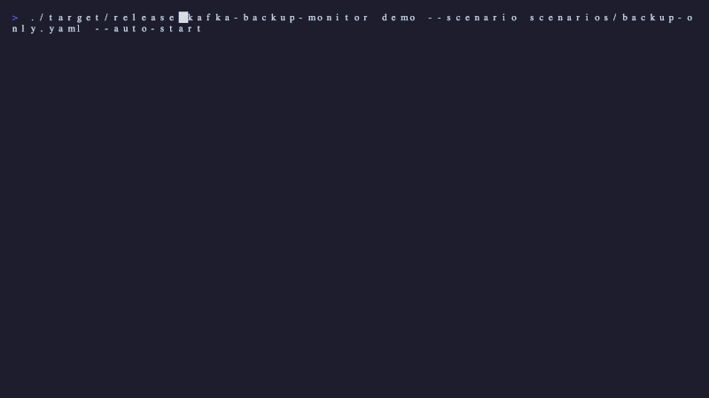

<p align="center">
  <h1 align="center">kafka-backup-monitor</h1>
  <p align="center">
    Real-time TUI dashboard for monitoring kafka-backup operations
  </p>
</p>

<p align="center">
  <a href="https://github.com/osodevops/kafka-backup-cli/blob/main/LICENSE">
    
  </a>
  <a href="https://www.rust-lang.org/">
    
  </a>
  <a href="https://github.com/osodevops/kafka-backup">
    
  </a>
</p>

<p align="center">
  
</p>

---

**kafka-backup-monitor** is a terminal dashboard built with Rust for monitoring [kafka-backup](https://github.com/osodevops/kafka-backup) backup and restore operations in real time. Track per-partition progress, throughput sparklines, compression ratios, and pipeline stages — all from your terminal.

Includes a **scripted demo engine** for creating screen recordings and marketing content with cinematic terminal animations.

## Features

- **Per-partition progress** — Live progress bars with throughput sparklines for every topic partition
- **Pipeline visualisation** — See data flow through Kafka, Consume, Compress, Store stages
- **Compression stats** — Real-time size reduction, ratio, and ETA tracking
- **Three-phase restore** — Visual indicator for multi-phase restore operations
- **Cinematic effects** — Fade, dissolve, sweep, and celebration animations powered by [tachyonfx](https://github.com/junkdog/tachyonfx)
- **Scripted demos** — YAML-driven scenarios for reproducible screen recordings

## Installation

### From source

```bash
git clone https://github.com/osodevops/kafka-backup-cli.git
cd kafka-backup-cli
cargo build --release
```

The binary is at `./target/release/kafka-backup-monitor`.

## Quick Start

### Run a demo scenario

```bash
# Backup demo (~20 seconds)
./target/release/kafka-backup-monitor demo --scenario scenarios/backup-only.yaml

# Full backup + disaster + restore (~60 seconds)
./target/release/kafka-backup-monitor demo --scenario scenarios/full-backup-restore.yaml
```

### Keyboard controls

| Key     | Action                      |
|---------|-----------------------------|
| `q`     | Quit                        |
| `Space` | Pause / resume (demo mode)  |
| `p`     | Toggle partition detail view |
| `t`     | Toggle throughput chart      |
| `l`     | Toggle expanded log panel    |

## Demo Scenarios

Five pre-built scenarios are included:

| Scenario | Duration | Description |
|----------|----------|-------------|
| `backup-only.yaml` | ~20s | High-speed backup of 3 topics with throughput animation |
| `full-backup-restore.yaml` | ~60s | Full backup, simulated disaster, three-phase restore |
| `restore-only.yaml` | ~30s | Restore monitoring with three-phase progress |
| `three-phase-restore.yaml` | ~25s | Detailed three-phase restore showcase |
| `pitr-demo.yaml` | ~30s | Point-in-time recovery with time window filtering |

## Screen Recording

Record demos as GIFs using [VHS](https://github.com/charmbracelet/vhs):

```bash
# Record a scenario
./scripts/record-demo.sh scenarios/backup-only.yaml

# Export for social media (LinkedIn, Twitter, YouTube Shorts, GitHub)
./scripts/export-social.sh recordings/kafka-backup-demo.gif
```

Terminal profiles for Alacritty, Kitty, and WezTerm are included in `assets/terminal-profiles/`.

## Tech Stack

| Crate | Purpose |
|-------|---------|
| [ratatui](https://ratatui.rs/) | TUI framework |
| [tachyonfx](https://github.com/junkdog/tachyonfx) | Terminal animation effects |
| [crossterm](https://github.com/crossterm-rs/crossterm) | Terminal backend |
| [clap](https://github.com/clap-rs/clap) | CLI argument parsing |
| [serde](https://serde.rs/) + [serde_yaml](https://github.com/dtolnay/serde-yaml) | YAML scenario parsing |
| [color-eyre](https://github.com/eyre-rs/eyre) | Error handling |

## Related

- [kafka-backup](https://github.com/osodevops/kafka-backup) — High-performance Kafka backup and restore with point-in-time recovery

## License

kafka-backup-monitor is licensed under the [MIT License](LICENSE).

---

<p align="center">
  Made with &#10084;&#65039; by <a href="https://oso.sh">OSO</a>
</p>
